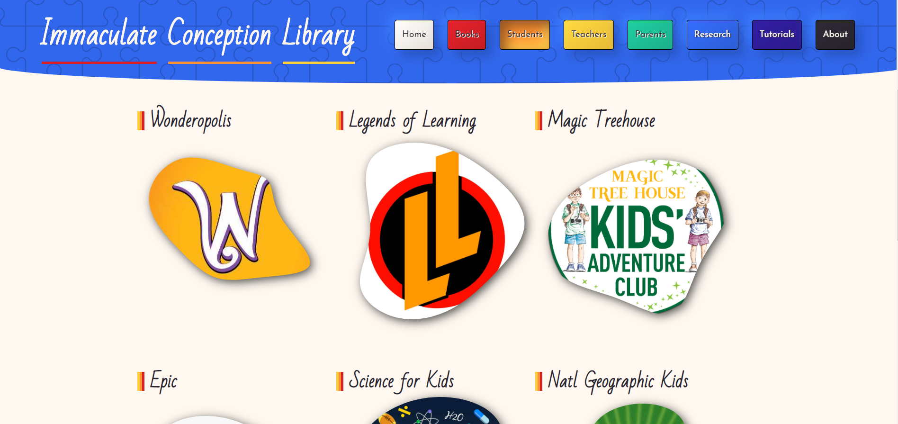

<h1>
  Immaculate Conception Library 📚
</h1>

A static site generated using [Gatsby](https://www.gatsbyjs.org/). Its function is to provide a visually engaging link-collection
to students of the Immaculate Conception Elementary School in Fayetteville, NY.

Some links have the school's login information embedded in the query string, for convenience.
In these cases, the URL is hidden from this repository, and instead dynamically put-together using Netlify environment
variables and lambda cloud functions, and the links have an onClick function rather than an href attribute.

Some of the school's paid resources are accessible through the Books and Teachers pages, so those pages are hidden
behind a basic authentication pattern in which the currently-guessed password, or no password, is saved in localStorage,
and checked against a single fixed password that the students know, which is also stored as a Netlify secret variable.

Even the auth-locked app routes are statically pre-generated using Gatsby's node APIs and hidden using Reach router navigation.
